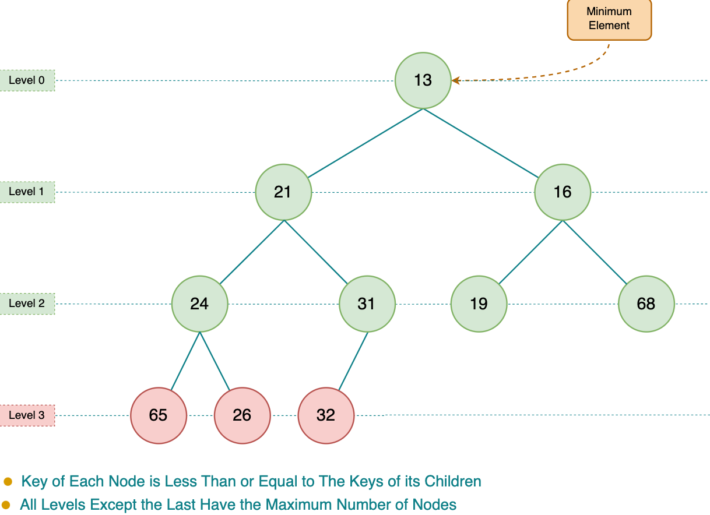

# Heap

Heaps are a specialized data structure and are based on binary trees. They are
structures that enable quick access to the minimum or maximum value and allow
priority-based ordering

Generally relationships are described as though the heap represents a family
tree:

- root node—The node at the top of the heap. In a min-heap, the root node has
  the smallest value.
- sibling—Nodes that share a common parent.
- cousins—Nodes that share a common grand-parent.

> Note that this is different to binary search tree in which there is a
> relationship between siblings and other nodes.

## Types

- max heap - every parent node has a value bigger than or equal to its children.

- min heap - every parent node has a value smaller than or equal to its
  children.

## Operations

Insert Element can be done with:

- iterative approach - new value "bubbles up" after being inserted at the end
  and swapped if greater value.
- recursive approach - insert at the end, then get parent, swap and again.

## Time complexity

- Find min/max - O(1)
- Insert - O(log(n))
- Remove - O(log(n))
- Heapify (create heap from any array) - O(n)
