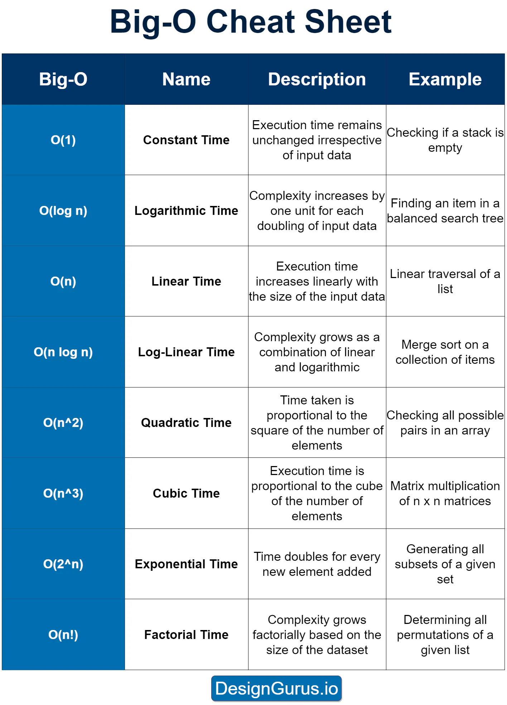
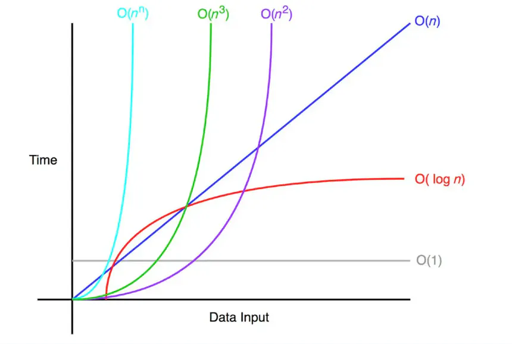

# Big-O

## Notes

- describe time or space (memory) complexity / performance
- how long will algorithm run as the input grows

Additionally, Big-O notation only considers the dominant term in the running
time equation. For example, an algorithm with a running time of O(n^2 + n) would
be simplified to O(n^2).

## Cheat sheet

## Examples

- O(log n) - binary search
- O(n log n) - quick sort (for, then recursion)
- O(n^2) - bubble sort (for in for)
- O(2^n) - fibonacci sequence (recursion of n)

For more about sorting (bubble, quick, merge) go to the chapter 13. For more
about searching (linear, binary) go to the chapter 14.
