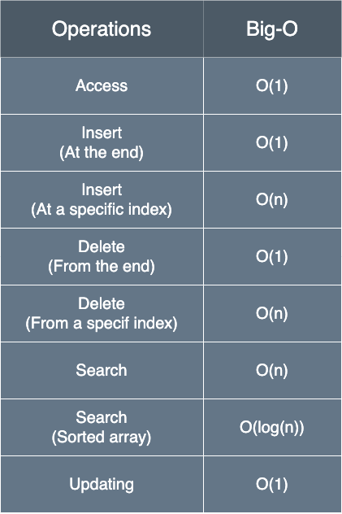

# Arrays

## Notes

- collection of elements, identified / accessed by an index

## Types

### Static-sized

Definition: Static-sized arrays have a fixed size, determined at compile time.
Once declared, the size of a static array cannot be changed.

Characteristics:

- Fixed Size: The number of elements the array can hold is defined when the
  array is created and cannot be altered.
- Memory Allocation: Memory for the array is allocated on the stack (in most
  programming environments), making allocation and deallocation fast.
- Performance: Accessing elements in a static array is fast because elements are
  **stored contiguously** in memory, enabling efficient indexing.

### Dynamic-sized

Definition: Dynamic-sized arrays can change size during runtime. They can grow
or shrink as needed, offering more flexibility.

Characteristics:

- Resizable: The array can adjust its size at runtime to accommodate more (or
  fewer) elements than initially declared.
- Memory Allocation: Memory for dynamic arrays is typically allocated on the
  heap, which allows them to have a flexible size but also means that memory
  management (allocation and deallocation) is more complex and slightly slower.
- Efficiency Considerations: While dynamic arrays provide flexibility, resizing
  operations (like increasing the array's size) may require allocating new
  memory and copying existing elements to the new location, which can be costly
  in terms of performance.

## Complexity

## Checklist

1. Validating Assumptions:

   - Duplicates: Always clarify if duplicate values are allowed. Understand and
     communicate how duplicates might affect your approach.
   - Sorted/Unsorted: Check whether the array is sorted or not, as certain
     algorithms (like binary search) require sorted arrays.

2. Boundary Conditions:

   - Index Out of Bounds: Always ensure that your code never tries to access an
     index outside of the array’s bounds. Use condition checks to prevent this
     common error.
   - Negative Indices: In certain languages like Python, negative indices access
     elements from the end of the array. Be cautious and deliberate in your use
     of them.

3. Efficiency Concerns:

   - Slicing and Concatenating: Remember slicing and concatenating can take
     time. Be careful with these operations as they introduce significant time
     complexity into your solution.
   - In-place vs. Extra Space: Consider whether creating a new array is
     necessary or if you can manipulate the existing array in place to save
     space.

4. Variable Naming and Loop Indices:

   - Descriptive Variables: Use descriptive variable names to keep your code
     readable and your logic clear, even under interview pressure.
   - Loop Indices: Be mindful of your use of loop indices, ensuring that loops
     end at the correct conditions to prevent off-by-one errors.

5. Algorithm Choice and Complexity:

   - Time and Space Complexity: Be conscious of the time and space complexity of
     the algorithms you choose and be prepared to discuss and justify them.
   - Nested Loops: Be wary of introducing nested loops, which can rapidly
     escalate time complexity (e.g., to O(n^2)).

6. Testing:

   - Corner Cases: Test your solutions with edge cases (e.g., empty arrays,
     single-element arrays, arrays with all identical elements) to ensure
     robustness.
   - Various Inputs: Test with both typical and edge cases to ensure your
     solution handles all possible scenarios adeptly.

7. Handling Zeros and Negatives:

   - Always check and clarify how to handle zeros and negative numbers in array
     problems. This is especially crucial in problems related to product or sum.

8. Modification During Iteration:

   - Be cautious when modifying an array as you iterate through it, as this can
     introduce bugs or unintended behaviors. Sometimes iterating backwards or
     using a separate array to store modifications can circumvent these issues.

9. Array Methods Familiarity:

   - Be familiar with the array methods provided by the language you’re using
     and understand their time and space complexities.

10. Partial Results:

    - Intermediate Variables: Consider whether storing intermediate results
      (e.g., prefix sums or suffix products) might optimize repeated
      calculations.
    - Multiple Passes: Weigh the pros and cons of making multiple passes through
      the array if it simplifies and optimizes the overall algorithm.

11. Parallel and Reverse Iteration:

    - Remember that sometimes iterating through an array from the end or through
      two arrays in parallel can be the key to an optimal solution.
