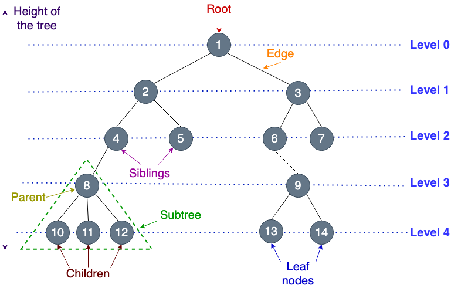
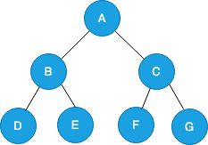
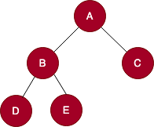
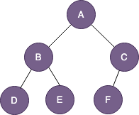
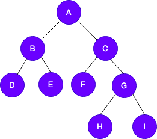
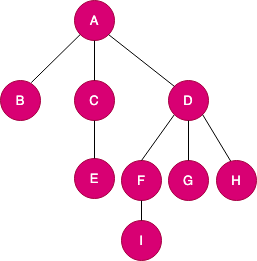
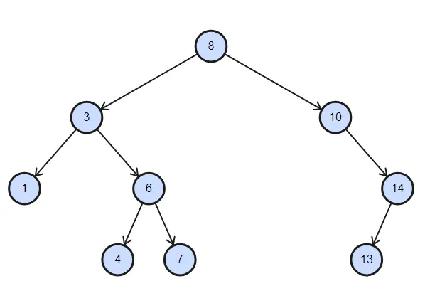
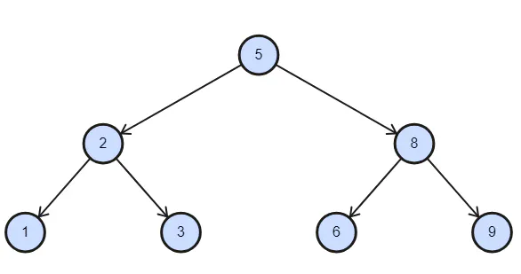

# Tree & Binary Search Tree

Trees are hierarchical structures consisting of nodes linked by edges. At the
top of the hierarchy is the root node, which acts as the starting point. All
other nodes are connected through edges. The nodes are grouped into levels, and
the maximum level of any node in the tree is referred to as the depth.

## Fundamental Concepts

- Root Node: The node at the top of the tree. It is the node from where the
  whole tree originates. For any tree traversal operation, this node serves as
  the starting point.

- Nodes: All the elements in the tree, including the root, are nodes, and each
  node has a unique value and may have child nodes connected to it.

- Parent Node: A node in a tree that has one or more child nodes connected to
  it.

- Child Node: Nodes that are directly connected to a parent node.

- Sibling Nodes: Nodes that share the same parent node.

- Ancestor Nodes: All the nodes in the path from a specific node to the root
  node.

- Descendant Nodes: All the nodes reachable from a specific node down to the
  leaves.

- Leaf Node: Nodes in the tree that do not have any children.

- Subtree: A smaller tree within the main tree, consisting of a node and its
  descendants.

## Tree Height and Depth

- The height of a tree is the **number of edges on the longest path** from the
  root node to the leaf node. It represents the depth of the tree from the root.
- The depth of a specific node in the tree is **the number of edges from the
  root node** to that particular node.

## Types of Tree

- Binary Tree - each node can have at most two children.

  

- Full Tree - every node has either zero children or two. There are no nodes
  with one. Sometimes called proper binary trees.

  

- Complete Tree - all levels are filled, except possibly the last one. The last
  level must be strictly filled from left to right.

  

- Balanced Tree - binary trees in which the difference in height between left
  and right subtrees of any nodes in the tree is not more than 1.

  

- Multi-way Tree - nodes can have more than two children.

  

- Binary Search Tree (BST) - binary tree in which each node has at most two
  children, referred to as the left child and the right child. **For a given
  node, all nodes in its left subtree have values less than or equal to the
  node's value, and all nodes in its right subtree have values greater than the
  node's value.** Search is O(logn).

  :

## Binary Search Tree - deep dive

### Abstract data type (ADT)

- Insertion - requires finding an appropriate position.

  - Best case O(logn), worst (unbalanced) O(n).

- Update

  - Best case O(logn), worst (unbalanced) O(n).

- Deletion - requires rebalancing of subtrees of the deleted note.

  - Best case O(logn), worst (unbalanced) O(n).

- Search - traversing with comparison recursively.

  - Best case O(logn), worst (unbalanced) O(n).

- In-order Traversal - visits the left subtree the current node and then the
  right subtree, resulting in the elements bing visited in ascending order.

  1, 2, 3, 5, 6, 8, 9.

- Pre-order Traversal - visits the current node, the left subtree and the right.

  5, 2, 1, 3, 8, 6, 9.

- Post-order Traversal - visits left, right and then the current.

  1, 3, 2, 6, 9, 8, 5.

### Issues

- Can ends up unbalanced or degenerate (each can have only one child).
- Complex balancing logic, insertion and deletion can be expensive
  - Not suitable for dynamic datasets - when frequent changes
- Lack of unique key
- Requires additional memory for pointers
