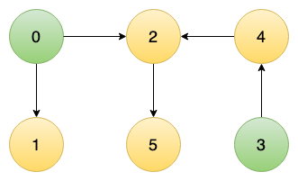
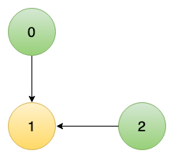
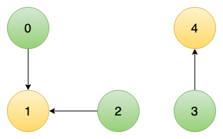

# Problem 3: Minimum Number of Vertices to Reach All Nodes(medium)

## Problem Statement

Given a directed acyclic graph with n nodes labeled from 0 to n-1, determine the
smallest number of initial nodes such that you can access all the nodes by
traversing edges. Return these nodes.

## Example

```text
Example 1:
  Input:
    n = 6
    edges = [[0,1],[0,2],[2,5],[3,4],[4,2]]
  Expected Output: [0,3]
  Justification: Starting from nodes 0 and 3, you can reach all other
  nodes in the graph. Starting from node 0, you can reach nodes 1, 2, and 5.
  Starting from node 3, you can reach nodes 4 and 2 (and by extension 5).
```



```text
Example 2:
  Input:
    n = 3
    edges = [[0,1],[2,1]]
  Expected Output: [0,2]
  Justification: Nodes 0 and 2 are the only nodes that don't have incoming edges.
  Hence, you need to start from these nodes to reach node 1.
```



```text
Example 3:
  Input:
    n = 5
    edges = [[0,1],[2,1],[3,4]]
  Expected Output: [0,2,3]
  Justification: Node 1 can be reached from both nodes 0 and 2,
  but to cover all nodes, you also need to start from node 3.
```



## Constraints

```text
2 <= n <= 10^5
1 <= edges.length <= min(10^5, n * (n - 1) / 2)
edges[i].length == 2
0 <= fromi, toi < n
All pairs (fromi, toi) are distinct.
```
