# Graph

A graph is a data structure that consists of a set of vertices (nodes) and a
bunch of edges connecting these vertices. Used to solve complex problems
involving relationships and connections.

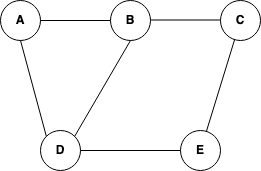

## Terminologies

- Node (Vertex) - dots
  - Adjacent - when an edge is connected directly. Also known as neighborhood.
    AB.
- Edges - connections (links/lines) between vertices (nodes)
- Digraph - graph in which edges have a direction or are represented by arrows.
  Each edge connects two vertices, but the direction of the edge indicates a one
  way relationship between nodes.
  - 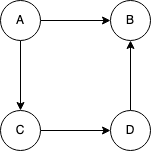
- Loop - refers to an edge that connects a vertex to itself.
  - 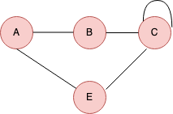
- Degree - number of edges a node is connected to.
  - Types
    - The in-degree (number of incoming edges)
    - The out-degree (number of outgoing edges).
  - In the below graph, the degree of node A is two because two edges are
    outgoing, and the degree of node C is 1.
    - 
- Path - A sequence of vertices in which each consecutive pair of vertices is
  connected by an edge.
- Cycle - A path in which the first and last vertices are the same, forming a
  closed loop.

## Types

- Undirected - edges have no direction, representing a bidirectional connection
  between two vertices. If an edge exists between vertex A and vertex B, you can
  traverse from A to B and vice versa.
  - 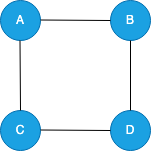
- Directed - edges have a direction, indicating a one-way connection between
  vertices. If there is an edge from vertex A to vertex B, you can only traverse
  from A to B, not vice versa.
  - 
- Weighted - Each edge is associated with a numerical value called a weight. The
  weight can represent distances, costs, or any other relevant metric between
  the connected vertices.
  - Transportation:
    - 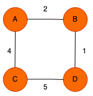
- Unweighted - All edges have the same default weight of 1 in an unweighted
  graph. There are no additional numerical values associated with the edges. In
  an unweighted graph, the absence of edge weights implies that all edges are
  considered to have equal importance or distance between the connected nodes.
  - Family Tree (Connection exists or doesn't):
    - 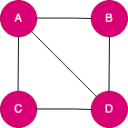
- Cyclic - a graph that contains at least one cycle, which is a closed path
  (sequence of vertices) that starts and ends at the same vertex.
  - 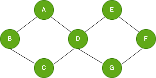
- Acyclic - An acyclic graph is a directed graph that has no cycles. A cycle
  occurs when the following edges from a node lead back to the same node. Some
  key properties of acyclic graphs:

  - They have at least one node with no incoming edges (called a source node).

  - They have at least one node with no outgoing edges (called a sink node). In
    this graph, node A is the root node. It has no incoming edges. Nodes D, E,
    F, G are leaf nodes - they have no outgoing edges. There are no cycles in
    this graph. A valid topological ordering of the nodes could be: A, B, C, D,
    E, F, G. So this graph structure forms an acyclic-directed graph. Trees and
    DAGs (Directed Acyclic Graphs) are common examples of acyclic graph
    structures
  - 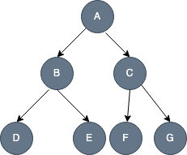

- Connected - one in which there is a path between every pair of vertices. In
  other words, every vertex is reachable from any other vertex in the graph.
  - 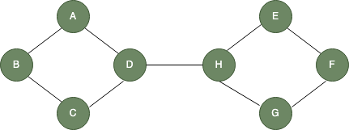
- Disconnected - graph has two or more connected components (subgraphs) with no
  direct connection between these components. The figure below is one separate
  graph. The first component contains A, B, C, and D vertices, and the other
  part contains E, F, G, and H, with at least two vertices not connected by a
  path.
  - 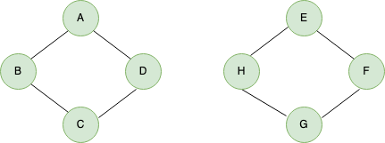
- Strongly connected - a type of directed graph in which there is a directed
  path from every vertex to every other vertex. In other words, for any two
  vertices, A and B, in a strongly connected graph, there is a directed path
  from A to B and B to A.
  - 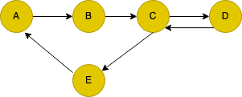

## Representations

### Adjacency matrix

It is a square matrix where the rows and columns represent the vertices of the
graph, and the entries (elements) of the matrix indicate whether there is an
edge between the corresponding vertices.

#### Undirected matrix

In an undirected graph with N vertices, the adjacency matrix A will be an N x N
matrix. For an undirected edge between vertices i and j, the corresponding
entries in the matrix (`A[i][j]` and `A[j][i]`) will have a value of 1,
indicating the presence of an edge. If there is no edge between vertices i and
j, the matrix entries will have the value of 0.

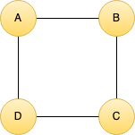
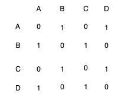

#### Directed matrix

In a directed graph with N vertices, the adjacency matrix A will also be an N x
N matrix. For a directed edge from vertex i to vertex j, the corresponding entry
in the matrix (`A[i][j]`) will have the value of 1, indicating the presence of
an edge from i to j. If there is no edge from vertex i to vertex j, the matrix
entry will have the value of 0.

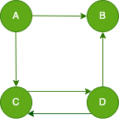
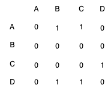

### Adjacency list

#### Undirected list

In an undirected graph, the edges between vertices have no direction. If vertex
A is connected to vertex B, then vertex B is also connected to vertex A. As a
result, the adjacency list for an undirected graph is symmetric.

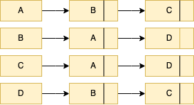

#### Directed list

In a directed graph, the edges between vertices have a direction. If vertex X is
connected to vertex Y, it does not necessarily mean that vertex Y is connected
to vertex X. As a result, the adjacency list for a directed graph is not
symmetric.

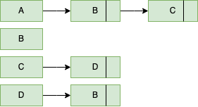

## Graph Traversal

Graph traversal involves visiting all the graph nodes following a specific
strategy or order. During traversal, each node is typically marked as visited to
avoid revisiting the same node multiple times and to prevent infinite loops in
cyclic graphs.

### Depth First Search (DFS)

Explores all the nodes in a graph by systematically visiting as far as possible
along each branch before backtracking. It operates on both directed and
undirected graphs and can be implemented using recursion or an explicit stack
data structure.

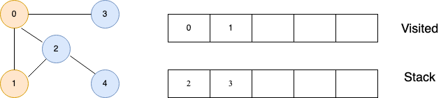

Steps: Initialization, Visit current, Recursively call, mark as visited,
backtracking, termination.

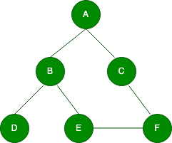

Starting from node A, let's perform DFS on this graph:

1. Start at node A (the source node).
1. Mark node A as visited and process it: A (visited).
1. Explore an unvisited neighbor of A. Let's say we choose B.
1. Mark node B as visited and process it: A -> B (visited).
1. From node B, explore an unvisited neighbor. We choose D.
1. Mark node D as visited and process it: A -> B -> D (visited).
1. Node D has no unvisited neighbors, so we backtrack to node B.
1. Node B has another unvisited neighbor, E. We explore E.
1. Mark node E as visited and process it: A -> B -> D -> E (visited).
1. From node E, explore an unvisited neighbor. We choose F.
1. Mark node F as visited and process it: A -> B -> D -> E -> F (visited).
1. Node F has one unvisited neighbor, C. We explore C.
1. Mark node C as visited and process it: A -> B -> D -> E -> F -> C (visited).
1. Node C has no unvisited neighbors, so we backtrack to node F.
1. Node F has no unvisited neighbors, so we backtrack to node E.
1. Node E has no more unvisited neighbors, so we backtrack to node B.
1. Node B has no more unvisited neighbors, so we backtrack to node A.
1. Node A has no more unvisited neighbors, and we have visited all reachable
   nodes.

The DFS traversal order for this graph starting from node A is: A -> B -> D -> E
-> F -> C.

### Breadth First Search (BFS)

<!--TODO: describe -->
