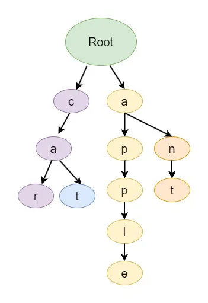

# Trie (aka Prefix Tree)

A specialized tree-based data structure primarily used for efficient storing,
searching, and retrieval of strings over a given alphabet. It is constructed to
represent a set of strings where each node in the tree corresponds to a single
character of a string.



Tries are commonly employed in applications such as spell checking, autocomplete
suggestions, and searching within dictionaries or databases.

## Representation of Trie Node

The Trie node has an array or list of children nodes, typically of size 26 to
represent the English lowercase alphabets (a-z). Additionally, there's a boolean
flag isEndOfWord to indicate whether the current node marks the end of a word in
the Trie.

```go
type TrieNode struct {
    children [26]*TrieNode
    isEndOfWord bool
}
```

## Operations

### Insertion

Complexities: Time (n), Space (n worst, 1 best)

1. Start from the root node. 1.For each character in the string:
   1. Check if the character exists in the current node's children.
   1. If it exists, move to the corresponding child node.
   1. If it doesn't exist, create a new node for the character and link it to
      the current node.
   1. Move to the newly created node.
1. After processing all characters in the string, mark the current node as the
   end of the word.

### Searching

Complexities: Time (n), Space (1)

1. Start from the root node.
1. For each character in the word: a. Calculate its index (e.g., 'a' is 0, 'b'
   is 1, ...). b. Check if the corresponding child node exists. c. If it exists,
   move to the child node and continue. d. If it doesn't exist, return false
   (word not found).
1. After processing all characters, check the isEndOfWord flag of the current
   node. If it's true, the word exists in the Trie; otherwise, it doesn't.

### Deletion

Complexities: Time (n; length), Space (n; recursion)

1. Start at the root of the Trie.
1. Base Case:
   1. If at the end of the word:
      1. Unset `isEndOfWord` if set.
      1. Return `true` if no children, otherwise `false`.
1. Recursive Case:
   1. For the current character:
      1. Check if the child node exists.
      1. If not, return `false`.
      1. Recurse on the child node.
1. Post-Recursion:
   1. Delete the child node if the recursion returns `true`.
   1. Return `true` if no children and `isEndOfWord` is not set; otherwise,
      `false`.
1. Finish: Word is deleted if it existed; otherwise, Trie is unchanged.
