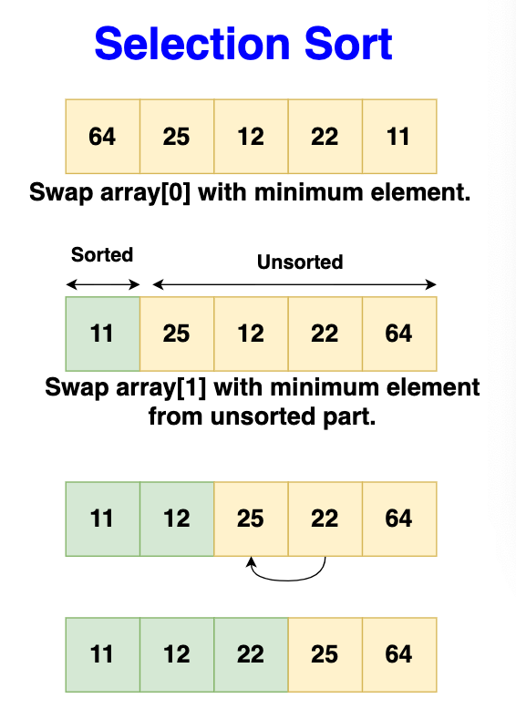

# Selection sort

Selection sort is a simple comparison-based sorting algorithm. The fundamental
idea is to repeatedly find the smallest (or largest, depending on sorting order)
element from the unsorted segment of the list and move it to the end of the
sorted segment. This process is repeated for each of the elements until the
entire array is sorted. The method divides the input list into two parts: a
sorted sublist of items which is built up from left to right at the front (left)
of the list, and a sublist of the remaining unsorted items that occupy the rest
of the list.

## Step-by-Step Algorithm

- Initialize:
  - Start with the first element of the array, treating it as the beginning of
    the unsorted section.
- Outer Loop (Sorting boundary):
  - Iterate from the start of the array to the second last element.
- Inner Loop (Find minimum):
  - Begin from the current position of the outer loop +1.
  - Compare each element with the current minimum.
  - If a smaller element is found, update the minimum element's index.
- Swap:
  - After the inner loop, swap the minimum element found with the first element
    of the unsorted section.
  - Move boundary:
  - Increment the starting index of the unsorted section.

Repeat the process until the entire array is sorted.

