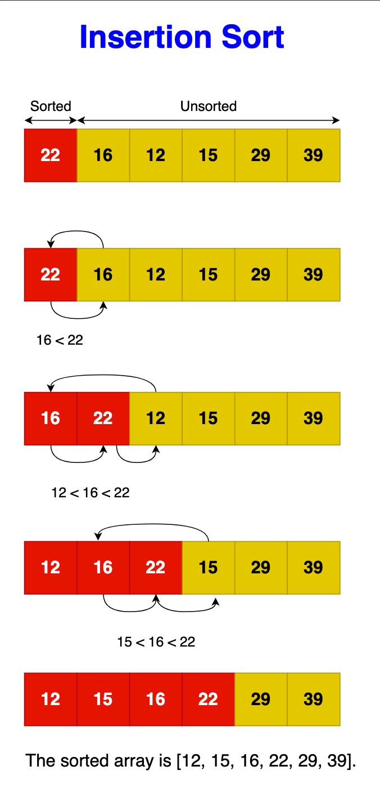

# Insertion sort

Insertion sort works similarly to the way you might sort playing cards in your
hands. It assumes that the first element is already sorted, then it goes through
the remaining elements one by one, placing each in its proper position relative
to those already sorted. The algorithm selects an element, compares it to the
elements in the sorted section, and inserts it in the correct position by
shifting all larger elements to the right. This process is repeated for each
element until the entire array is organized. This method is intuitive and mimics
a common human approach to sorting.

## Step-by-Step Algorithm

- Start with the second element:
  - Consider the first element sorted by default and start with the second
    element.
- Outer Loop (To place the element):
  - For each element in the array from the second to the last.
- Inner Loop (Find the correct position):
  - Compare the current element with the elements in the sorted section.
  - Shift all larger elements in the sorted section to the right to make space.
- Insertion:
  - Insert the current element into the correct position within the sorted
    section.
- Repeat:
  - Continue until the whole array is sorted.

