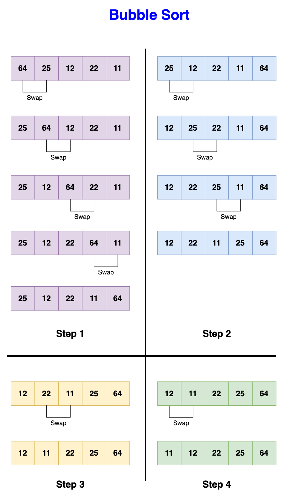

# Bubble sort

Bubble sort is a simple sorting algorithm that repeatedly steps through the
list, compares adjacent elements, and swaps them if they are in the wrong order.
The pass through the list is repeated until the list is sorted. The algorithm
gets its name because smaller elements "bubble" to the top of the list
(beginning) as the sorting progresses.

## Step-by-Step Algorithm

- Start at the beginning:
  - Begin with the first element of the array.
- Outer Loop (Complete passes):
  - Iterate from the start of the array to the end.
- Inner Loop (Comparison and swap):
  - Compare each pair of adjacent elements.
  - If they are in the wrong order, swap them.
- Optimization Check:
  - If no swaps are made in a new pass, the list is sorted, and the algorithm
    stops early.
- Repeat:
  - Continue the process until the entire array is sorted.

