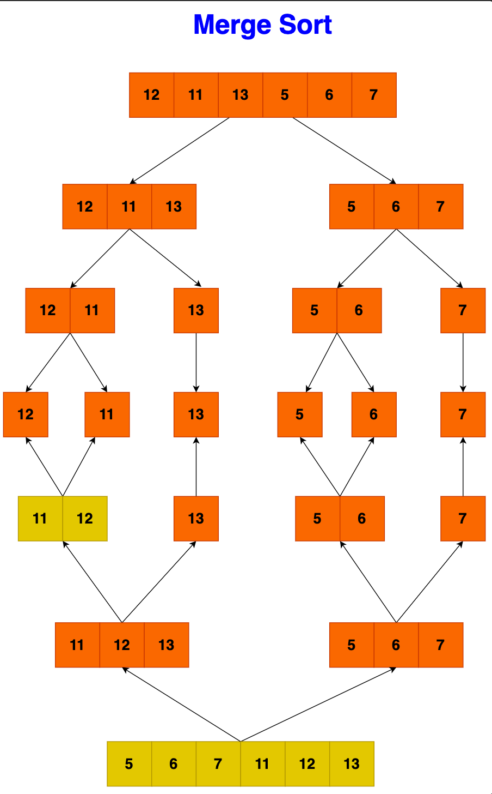

# Merge sort

Merge sort is an efficient, stable sorting algorithm that employs a
divide-and-conquer approach to order elements. By dividing the array into
halves, sorting each half, and then merging them back together, it ensures that
the entire array is sorted. This method is particularly effective for large data
sets where efficiency is crucial.

## Step-by-Step Algorithm

- MergeSort(arr, left, right):

- If left < right:
  - Find the middle point: m = (left + right) / 2.
  - Recursively sort the first half: MergeSort(arr, left, m).
  - Recursively sort the second half: MergeSort(arr, m + 1, right).
  - Merge the two sorted halves using Merge(arr, left, m, right).
- Merge(arr, left, m, right):
  - Determine the sizes of two subarrays to be merged: sizeLeft = m - left + 1,
    sizeRight = right - m.
  - Create temporary arrays L[] (for the left subarray) and R[] (for the right
    subarray).
  - Copy data to L[] from arr[left...m] and R[] from arr[m+1...right].
  - Initialize three pointers: i = 0 (for traversing L[]), j = 0 (for traversing
    R[]), and k = left (for the merged array).
  - Merge arrays L[] and R[] back into arr[left...right]:
    - Compare each element of L[] with R[] and copy the smaller element into
      arr[k].
    - Increment i or j based on which element was copied, and increment k.
- Copy any remaining elements in L[] and R[] to arr[], if there are any.

Key Points

- Divide: The array is divided into two halves using the MergeSort function
  recursively.
- Conquer: Each half is sorted recursively using the same MergeSort function.
- Combine: The sorted halves are merged into a single sorted array using the
  Merge function.

