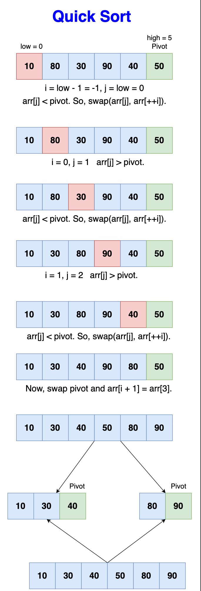

# Quick sort

Quick sort is a highly efficient sorting algorithm that also uses the
divide-and-conquer approach. It partitions the array into two smaller arrays
based on a pivot element such that elements less than the pivot are on one side,
and elements greater than the pivot are on the other. These sub-arrays are then
recursively sorted.

The efficiency of quick sort comes from its ability to sort the array in-place,
and its performance can be nearly two or three times faster than mergesort or
heapsort under the right conditions.

## Step-by-Step Algorithm

- QuickSort(arr, low, high):
  - If the sub-array has more than one element (low < high):
    - Partitioning: Perform the partition using Partition(arr, low, high) and
      get the pivot position pi.
    - Recursively sort sub-arrays: Apply quicksort to the elements before the
      pivot (QuickSort(arr, low, pi - 1)) and the elements after the pivot
      (QuickSort(arr, pi + 1, high)).
- Partition(arr, low, high):
  - Pivot Selection: Choose the last element as the pivot, pivot = arr[high].
  - Initialization: Set i = low - 1 to indicate the right position of the pivot
    found so far.
  - Iteration over sub-array:
    - For each element j from low to high-1, compare arr[j] with pivot.
    - If arr[j] < pivot, increment i and swap arr[i] and arr[j].
  - Final placement of the pivot: After the loop, swap arr[i + 1] with arr[high]
    to place the pivot at its correct sorted position.
  - Return i + 1, the index of the pivot.

