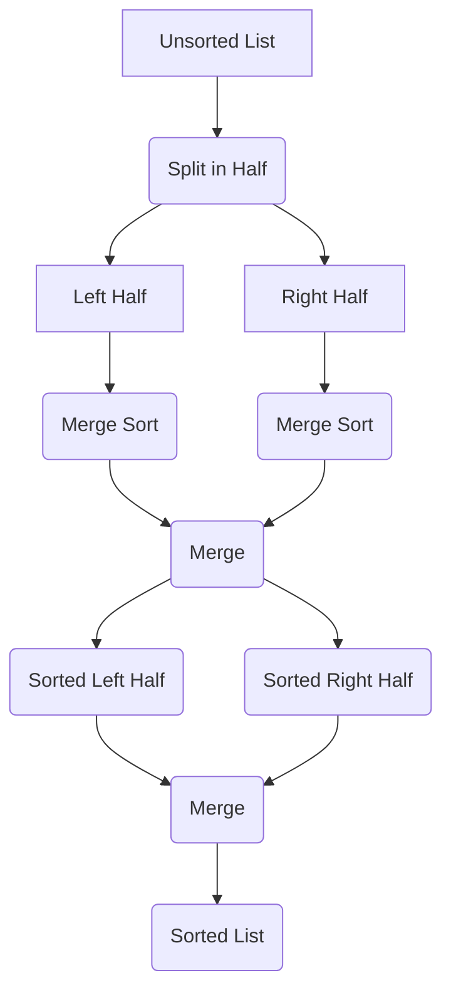

# Merge sort

## Explanation (ai based)

1. **Unsorted List (A)**: This is the initial input list that needs to be
   sorted.
2. **Split in Half (B)**: The unsorted list is divided into two equal (or nearly
   equal) halves.
3. **Left Half C** and **Right Half (D)**: These represent the two halves
   obtained after splitting the original list.
4. **Merge Sort (E and F)**: Each half is subjected to the merge sort algorithm
   recursively. This means that the merge sort algorithm is applied
   independently to both the left and right halves until they are sorted.
5. **Merge (G)**: After the left and right halves are sorted individually, they
   are merged back together into a single sorted list.
6. **Sorted Left Half (H)** and **Sorted Right Half (I)**: These represent the
   sorted versions of the left and right halves obtained after applying the
   merge sort algorithm recursively.
7. **Merge (J)**: Once the left and right halves are sorted, they are merged
   together using the merge operation.
8. **Sorted List (K)**: Finally, after merging the sorted left and right halves,
   we obtain the fully sorted list.

The merge operation is a crucial step in the merge sort algorithm. It combines
two sorted lists into a single sorted list. The merge process involves comparing
elements from the two lists and placing them in the correct order into a new
list. This process continues until all elements from both lists are included in
the merged list.

Here's how the merge operation works in detail:

- Compare the first elements of both lists.
- Place the smaller (or larger, depending on the sorting order) element into the
  merged list.
- Move to the next element in the list from which the element was taken.
- Repeat the comparison and placement process until all elements from both lists
  are included in the merged list.

This process ensures that the merged list contains all elements from the
original lists in sorted order. The merge operation is performed recursively
during the merge sort algorithm until the entire list is sorted.
