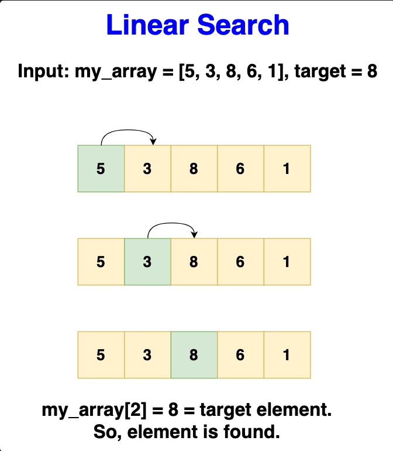

# Linear search

> Scans each element in the array sequentially to find a match with the target
> value.

Useful when dealing with small or unsorted arrays or lists where the overhead of
preparing the data (like sorting required for binary search) would outweigh the
benefits of a faster search algorithm.

## Pros

- Simple and easy to implement.
- Does not require the data to be sorted.
- Effective for small datasets.

## Cons

- Inefficient for large datasets, as performance degrades linearly with size.
- Requires more time to find elements as the dataset size increases, or to
  conclude an element is not present.
