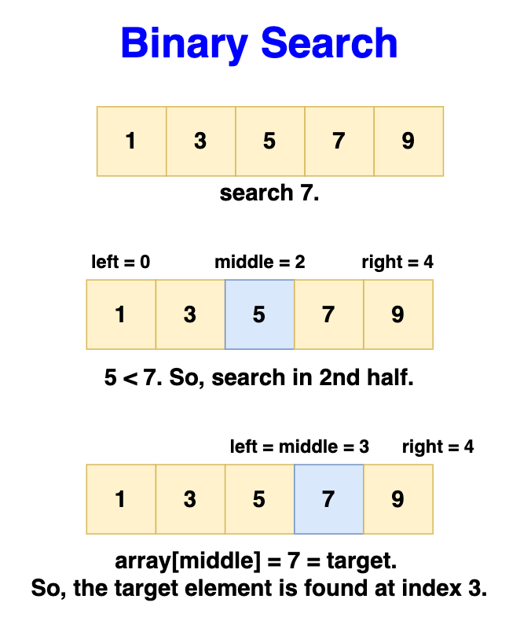

# Binary search

> Algorithm used for finding the position of an element in a **sorted** array.
> Binary search divides the search interval in half repeatedly.

## Pros

- Efficient for large datasets: The logarithmic time complexity makes it
  particularly efficient for searching large arrays.
- Minimal comparisons needed: Reduces the number of comparisons dramatically
  compared to linear search.
- Predictable: Due to its methodical elimination process, the maximum number of
  steps can be calculated beforehand.

## Cons

- Requires sorted array: The array must be sorted to apply binary search, which
  can be costly if the data is not already sorted.
- Not efficient for small datasets: The overhead of preparing the data (sorting)
  might not be worth the gains from a faster search.
- Poor worst-case performance: In the worst case, the time to sort the array and
  then perform a binary search might not be better than a simple linear search,
  especially for smaller or unsorted datasets.
