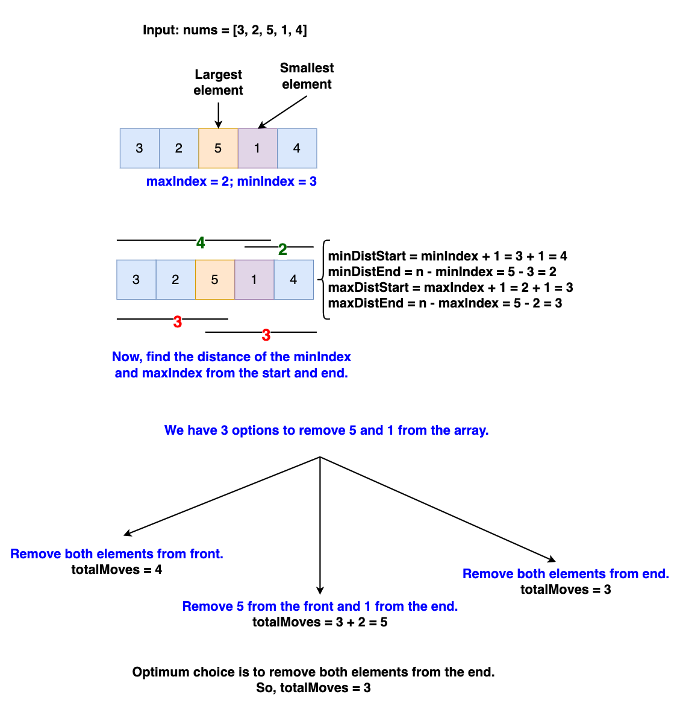

# Algorithm Walkthrough

For the input [3, 2, 5, 1, 4]:

1. Identify the Smallest and Largest Elements:
   - Smallest element: 1 at index 3.
   - Largest element: 5 at index 2.
1. Calculate Distances from Both Ends:
   - Distance of 1 from the start: 4.
   - Distance of 1 from the end: 2.
   - Distance of 5 from the start: 3.
   - Distance of 5 from the end: 3.
1. Determine the Most Efficient Removal Sequence:
   - Option 1: Remove elements from start to reach 5 and then from the end to
     reach 1. Total moves = 3 (for 5) + 2 (for 1) = 5.
   - Option 2: Remove both elements from the end. Total moves to reach at 5 from
     the end is equal to 3.
   - Option 3: Remove both elements from the start. Total moves to reach at 1
     from the end is equal to 4.
1. Choose the Optimal Sequence:
   - Option 2 provides the optimal result. The total number of moves required
     is 3.

