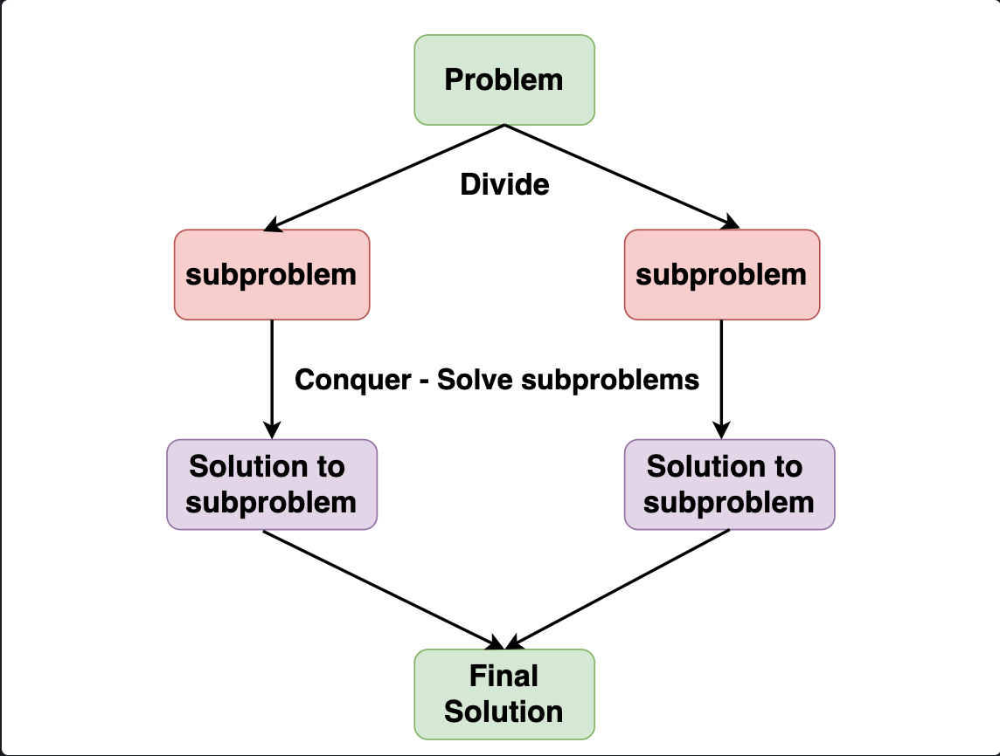

# Divide and Conquer Algorithm

> A clever way to solve big problems by breaking them down into smaller, easier
> ones.



## Pseudo code

```go
func DAC(a []int, low, high int) int {
    // Base Case: Check if the problem is small enough to solve directly
    if isSmallEnough(a, low, high) {
        return directSolution(a, low, high)
    }

    // Divide: Split the problem into smaller subproblems
    mid := findMidPoint(low, high) // Determine the midpoint for dividing

    // Conquer: Recursively solve each subproblem
    solution1 := DAC(a, low, mid)   // Solve the first half
    solution2 := DAC(a, mid+1, high) // Solve the second half

    // Combine: Merge the solutions of the subproblems to get the final solution
    return combineSolutions(solution1, solution2)
}
```

Example: Merge Sort.

## Divide and Conquer vs Dynamic Programming

Both Divide and Conquer (D&C) and Dynamic Programming (DP) are algorithmic
paradigms that solve problems by breaking them down into smaller subproblems.
However, they differ significantly in how they approach these subproblems:

1. Approach to Subproblems

   - Divide and Conquer: It divides the problem into independent subproblems and
     solves each one separately. The solutions to these subproblems do not
     depend on each other.
   - Dynamic Programming: DP also breaks problems down into subproblems, but
     these subproblems are not independent. DP solves each subproblem only once
     and stores the result in a table, avoiding the work of recalculating the
     answer every time the subproblem occurs.

2. Use Cases

   - Divide and Conquer: Best for problems with unique subproblems like
     quicksort or merge sort.
   - Dynamic Programming: Ideal for problems where the same subproblems are
     solved multiple times, such as computing the nth Fibonacci number or
     solving the Knapsack problem.

### Example: Fibonacci Number Calculation

1 Divide and Conquer Approach (Simple Recursion):

```go
def fib(n):
    if n <= 1:
        return n
    return fib(n-1) + fib(n-2)
```

This approach recalculates the same Fibonacci numbers many times.

2 Dynamic Programming Approach (Memoization):

```go
def fib(n, memo={}):
    if n <= 1:
        return n
    if n not in memo:
        memo[n] = fib(n-1, memo) + fib(n-2, memo)
    return memo[n]
```

This approach stores the results of subproblems, preventing redundant
calculations.

D&C works well for problems with distinct subproblems, while DP is more
efficient for problems with overlapping subproblems due to its ability to store
and reuse previous results.
